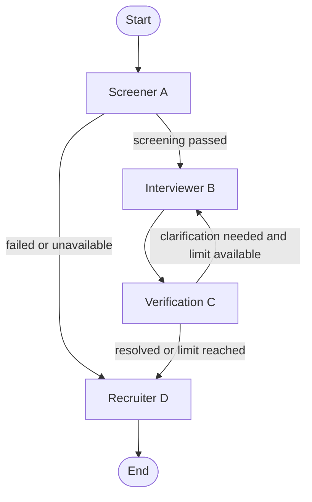

# HR System - COE749

Four cooperating agents screen a CV, conduct an interview, assess supporting
evidence, and produce a policy-based hiring recommendation. All agents use live
Gemini. The command-line demo can either collect typed answers or explicitly
simulate them.

## Run

Python 3.12 was used for integration testing. From the repository root:

```powershell
python -m venv .venv
.\.venv\Scripts\python.exe -m pip install -r requirements.txt
Copy-Item .env.example .env
```

Set `GEMINI_API_KEY` in `.env`. The default model is
`gemini-3.5-flash-lite`, configurable with `GEMINI_MODEL`.
`GOOGLE_API_KEY` is also accepted; `GEMINI_API_KEY` takes precedence.
An optional `GITHUB_TOKEN` increases the rate limit for public GitHub reads.
Keep `.env` private; it is ignored by Git.

Run the synthetic demo, with Gemini-generated candidate answers:

```powershell
.\.venv\Scripts\python.exe -m src.main --simulate --output runs/demo.json
```

Run an interview with your own UTF-8 text files and type each answer:

```powershell
.\.venv\Scripts\python.exe -m src.main --cv path\to\cv.txt --jd path\to\job.txt
```

The default input files are synthetic classroom fixtures under `src/data/demo_*.txt`.
The original team sample files remain available but are not used by default.
PDF input is not implemented in this CLI; supply extracted text.
Omit `--simulate` to collect real typed answers. Paste or type as many paragraphs
as needed, then type `/done` on its own line and press Enter to submit the answer.
Blank lines do not submit. Type `/clear` on its own line to replace the current
draft. Ctrl+C stops the interview; an answer without `/done` is not submitted.
`--max-follow-ups 0..5` defaults to 2.

A second live demo route exercises early screening rejection:

```powershell
.\.venv\Scripts\python.exe -m src.main --simulate --jd src/data/demo_reject_jd.txt --output runs/rejection.json
```

LLM judgments can vary. These commands invoke the live model, so their exact
scores and routes are not deterministic and each request uses provider quota.
There is no offline application mode. Unit tests mock external boundaries.

To exercise a potential positive decision with the current evidence policy, use
the synthetic trainee case. Its claims concern Python testing and SQL knowledge,
and its job description requires no degree or employment history:

```powershell
.\.venv\Scripts\python.exe -m src.main --simulate --cv src/data/skills_demo_cv.txt --jd src/data/skills_demo_jd.txt --output runs/skills-demo.json
```

Omit `--simulate` to answer the questions yourself. The CV also supplies the
third-party HR-System repository as a reference; this is not candidate ownership.
This case uses the normal agents, thresholds, and evidence checks. A hire result
is not guaranteed: model assessments, extracted claims, and provider availability
can vary. It demonstrates a narrow skills assessment, not verification of a
complete employment or education history.

## Workflow



A failed screening still reaches D so the system records a rejection and reason.
C requests a clarification for contradicted, unknown, or low-support claims.
The graph owns the round counters. After the follow-up limit, unresolved evidence
reaches D's review policy. There is no unbounded loop.

## Responsibilities and state changes

| Node | Main reads | Partial update |
| --- | --- | --- |
| A: Screener | CV text, job description | parsed CV, preserved repository URLs, stable claim IDs, job-match score, screening result and rationale |
| B: Interviewer | parsed CV, job description, previous transcript, verification notes/flags, round | accumulated questions/answers, interview completion, answer source, clears follow-up request |
| C: Verifier | claims, transcript, GitHub username/repository links, cached evidence | claim verdicts/support/evidence, flags, verification completion/notes, follow-up request, GitHub cache |
| D: Recruiter | screening, transcript/scores, verified claims, flags/completion | missing interview scores and rationales, overall score, decision, explanation |
| Graph wrapper | current counters, node update | increments interview/follow-up counts and resets verification completion after B |

B's submitted implementation does not grade answers. D grades the answers at the
end of the interview, including follow-ups, before aggregation. Existing valid
scores are preserved; only missing scores are requested. Each score includes a
rationale and is linked to its answer index.

The shared `HRState` extends Pydantic `BaseModel`. It contains strings,
bounded floats, booleans, lists, dictionaries, nested records, and optional fields.
Every node returns a dictionary containing only its changes. The graph validates
the merged state, including D's final output.

All lists use **replacement semantics**: B returns the complete old-plus-new
transcript. There is no additive reducer that could duplicate entries.
A assigns `C1`, `C2`, etc.; C must return each ID exactly once.
These IDs survive every verification round.

- `verified=True`: supported by the available evidence.
- `verified=False`: explicitly contradicted.
- `verified=None`: unknown or insufficient evidence.
- `confidence`: support for the claim being true, from 0 to 1. Unknown claims
  have no score; high certainty in a contradiction must not become high support.
- `evidence_refs`: citations to numbered answers (`interview:1`, etc.) or
  successfully retrieved public evidence (`profile:user`, `repo:user/name`).
  C validates each reference against the evidence actually available for that
  claim and derives the source label from those references.
- `consistency_flags[claim_id]=True`: an unresolved contradiction, consistently
  across B, C, and D. Unknown evidence can request a follow-up without a true flag.
- `verification_completed=True`: C has finished the round; this does not itself
  mean all claims were verified.

## Tools and structured output

A calls CV extraction and job-match tools. B calls the CV-section and question-bank
tools. C calls public GitHub profile/repository tools and a lexical-overlap tool.
D calls interview evaluation, weighted aggregation, and decision-policy tools.

CV parsing, matching, question generation, answer simulation, verification,
interview evaluation, and the final explanation all use Pydantic response schemas
with Gemini's JSON Schema output mode. Structured fields are validated locally.
The numeric aggregation and decision policy run in Python; the LLM explains the
result and cannot change the decision label.

C's GitHub tools distinguish successful evidence from inaccessible/private,
rate-limited, and failed requests. Missing public access does not imply lying.
The language comparison is `None` when no language claim was supplied.
Profile and repository responses are cached for the current candidate/thread,
including unavailable responses; restart a run to refresh that evidence.
Repository links are extracted directly from the original CV into
`github_repository_urls`, independently of the model's summary. C also reads
the raw CV, parsed projects, claim text, and interview answers, so older saved
states and links supplied during follow-ups work. Duplicate links, `.git`
suffixes, and repository subpaths resolve to one repository lookup.
Fetched results appear under `github_evidence`, such as
`repo:malak-darwish/HR-System`. A lookup does not establish candidate ownership.
Repository citations remain limited to claims that explicitly contain that
repository's URL; other fetched references provide context only. If extraction
omits a linked claim, the lookup is still recorded but does not increase scores
for unrelated claims. Profile ownership extraction still depends on the model.
Lexical overlap is labelled as a diagnostic and never directly determines a flag.

Evidence checks in Python cap interview-only support at 0.80 and support citing
accessible public GitHub evidence at 0.95. These are provisional ceilings, not
calibrated probabilities. A verdict without citations becomes unknown; a citation
to evidence the system did not retrieve is rejected. Source labels cannot turn
an interview answer into a GitHub verification.

Education and employment-history claims remain unknown when their only sources
are interview statements or repository metadata. Current tools do not retrieve
institutional or employer records. A technically detailed project answer can
support understanding of the implementation; it does not independently establish
authorship or historical performance figures. The LLM still judges the relevance
of cited content, so valid citations alone do not establish factual correctness.

## Scoring and decisions

Provisional project policy, inherited from D's standalone work:

```text
overall = 0.30 * screening
        + 0.40 * mean(interview scores)
        + 0.30 * mean(assessed claim support for mandatory job requirements)
```

Each answer has equal weight within the interview average; each scored claim has equal
weight within the evidence average. Interview grading considers relevance (30%),
soundness (40%), and concrete explanation (30%). These LLM scores are estimates,
not calibrated probabilities.

A's screening threshold is 0.60. D applies rules in this order:

1. Screening failed -> reject.
2. Missing screening/score/mandatory evidence, unfinished interview or verification,
   incomplete consistency flags, unresolved contradictions, or an unexplained
   clarification request -> waitlist for review.
3. Otherwise, score >= 0.75 -> hire; score >= 0.50 -> waitlist; lower -> reject.

Scores remain unrounded for comparisons. Missing evidence is never replaced by
zero. Some runs therefore finish with `overall_score=None` and `waitlist`.
A numerical score may exist even when a contradiction blocks hiring.
The explanation always retains the exact policy reason plus Gemini's elaboration.
Repeated leading copies of the policy reason are removed from that elaboration.

D extracts mandatory requirements from the job description before seeing the
candidate, then maps them to C's existing assessments and cited evidence. Optional
unknown claims remain unverified and disclosed, but do not alone block hire.
Missing mandatory requirements, including those absent from the CV, still block
hire. Mandatory degrees/employment records require documentation the current tools
cannot retrieve. Contradictions in any claim still require review.

The output includes `requirement_assessments`, `requirement_coverage`,
`required_evidence_complete`, `scored_claim_ids`, `excluded_claim_ids`,
`verification_limitations`, and `interview_average`. A numeric overall score can
exist with incomplete requirement coverage; it never overrides the evidence gate.
Weights and thresholds are unchanged. C's verdicts are never promoted by D.
Requirement extraction and semantic evidence mapping remain model judgments;
Python checks quotation provenance, ID coverage, citations, and decision rules.
A/B/C and graph routing are unchanged, so optional unknowns may still consume
follow-up rounds before D evaluates the narrower required-evidence gate.

## Checkpoints and validation

The graph compiles with `MemorySaver` and a unique `thread_id`.
It checkpoints after node transitions. History and conditional routes are shown
in CLI output, together with each partial state update. Saved JSON includes
the trace and final state.

MemorySaver is **in-memory only**: a process restart loses its checkpoints.
A saved JSON run is an audit export, not a persistent LangGraph checkpoint.
Programmatic pause/resume is supported through `interrupt_before` and
`graph.invoke(None, config)` in the same process. Typed answers are collected
inside B; an interrupted node must recollect answers not yet checkpointed.

Run the automated tests:

```powershell
.\.venv\Scripts\python.exe -m unittest discover -s tests -v
```

The tests execute real nodes, tool functions, and graph routing with controlled
LLM/HTTP responses. They cover rejection, hiring, resolved and unresolved
follow-ups, unknown evidence, transcript retention, score alignment and
boundaries, invalid outputs, GitHub failures, and checkpoint isolation/resume.
They also cover unsupported source labels, missing/invalid evidence citations,
confidence ceilings, historical-claim limits, and duplicated decision wording.
They do not establish the model's factual accuracy.

## Evidence limits

This is a classroom prototype. Interview statements can support a technical-skill
assessment but cannot independently verify employment, education, or repository
authorship. GitHub metadata and README text also cannot prove who did the work.
The verifier records those limits and can leave claims unknown.
Simulated answers and their final decisions are labelled as demo assessments.
A factual or hiring-quality evaluation on a labelled dataset has not been done.

Gemini requests have a 90-second timeout and one bounded retry for transient
provider errors. If they still fail, the run stops without fabricating a result.
The error names the failed structured-output step and redacts configured
credentials. Provider availability, latency, and quota still affect live runs.

The A/C baseline comes from `agent-3` at `53c2a94`, and B's implementation comes
from `agent-2` at `bdf9c77`. This branch adapts those agents to a shared state and
adds Person D's recruiter, scoring, integration, and regression tests.
The `agent-4` branch provides the same recruiter component separately for teams
that want to integrate it into their own workflow.
